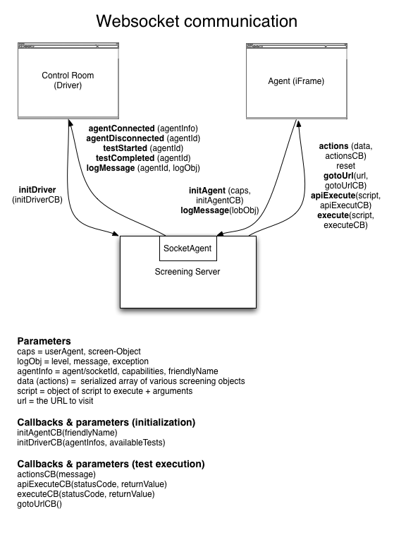

<!-- <copyright>
 This file contains proprietary software owned by Motorola Mobility, Inc. 
 No rights, expressed or implied, whatsoever to this software are provided by Motorola Mobility, Inc. hereunder. 
 (c) Copyright 2011 Motorola Mobility, Inc.  All Rights Reserved.
 </copyright> -->

# Agent communication

Agents are entities which are able to remote control one or more browsers and this document 
describes the types of agents that are supported by Screening and how the communication
between our server and the individual agents works.

## AgentPool

The AgentPool (`server/lib/agent-pool.js`) is our central place where we manage all the 
agents that are connected to our Screening server. It allows adding new agents, deleting
agents, getting a list of agents or getting a reference to one specific agent.

## iFrame Agent

This Agent (`server/lib/socket-agent.js`) represents a client that connects itself 
through a websocket (using `socket.io`) to the server. On the client-side this agent needs
to be opened manually by either clicking on `New agent` or opening the URL
`http://HOST_OR_IP:8081/screening/agent/index.html`. Through this action a new URL is opened
which itself connects via websocket to the server (notifies the AgentPool) and provides an 
iFrame which then can be remote controlled by the `socket.io` library on the server.

Note: This agent is also used to record an interaction with an application.

All the communication between external socket-clients and the server can be found in 
`server/lib/socket-agent.js`, `server/lib/sockets.js` and `server/lib/testcase-runner-iframe.js`.
The `socket-agent.js` is the component which is responsible for providing functionality to
change the state of the agent (connected, start/stop recording, start/stop test execution), the
`sockets.js` is the part which connects agents/drivers to the Screening server and the
`testcase-runner-iframe.js` is caring about sending individual commands to an agent (e.g.
execute JavaScript, goto URL, ...).

The diagram above illustates the webdriver communication between the server and the 
agent / control-room instances. It does not cover the recording events of the iFrame agent.

For details how the server is executing a Testscript and sending individual commands to an 
iFrame agent see `TestScriptExecution.md`.

## Webdriver Agent

This agent (`server/lib/webdriver-agent.js`) is responsible for handling the connection 
between the server and a remote Webdriver instance. Our Screening server is able to communicate
with a Webdriver server through a HTTP REST-API which is standardized in the 
[JSONWireProtocol](http://code.google.com/p/selenium/wiki/JsonWireProtocol "JSONWireProtocol").
The big difference to the iFrame agent is, that we can connect a Webdriver by telling the Screening 
server the base URL of it (either through the Control-Room or via REST-API) and we 
are then able to remote-control as many browser instances this particular Webdriver can handle.

`server/lib/testcase-runner-webdriver.js` is basically just the initializer for providing 
a connection to the Webdriver client library, which can be found in `server/lib/webdriver`. The
Webdriver client library is a modified version of 
[Webdriver-JS](https://github.com/dmachi/webdriver-js "Webdriver-JS") and provides a complete
client implementation of the Webdriver API as of 2011-09-19. 

In Screening we don't use the complete functionality of this library yet and it will be decided in 
the future if more parts of this library will be used.

Details about concrete communication between our server and a Webdriver can be found in
`server/lib/teststep-runner-webdriver.js`. There you'll see which parts of the Webdriver
library are used and how the Screening JS-API maps to the Webdriver API. 

In this diagram you see an overview how the Screening server is communicating to remote Webdriver instances and gives an overview of the architecture of Webdriver and its components.

Further details about the Webdriver can be found on 
[Selenium Wiki](http://code.google.com/p/selenium/w/list "Selenium Wiki")

The document `TestScriptExecution.md` is explaining in detail how a Testscipt is executed and how individual commands are sent to the `Webdriver-Teststep-Runner`.
