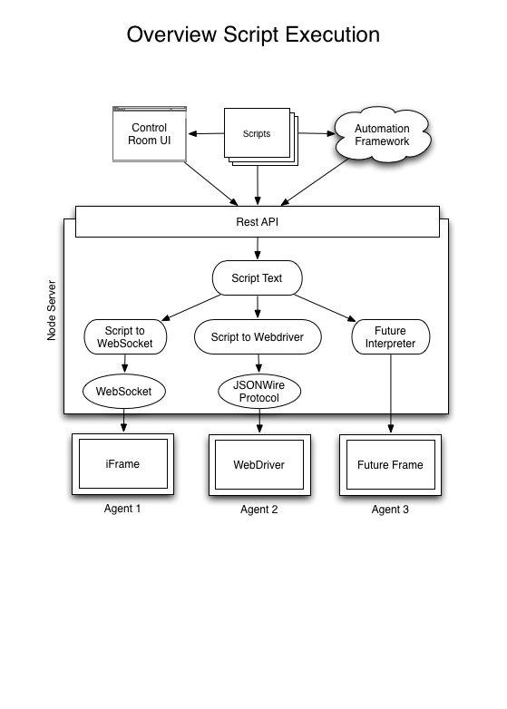
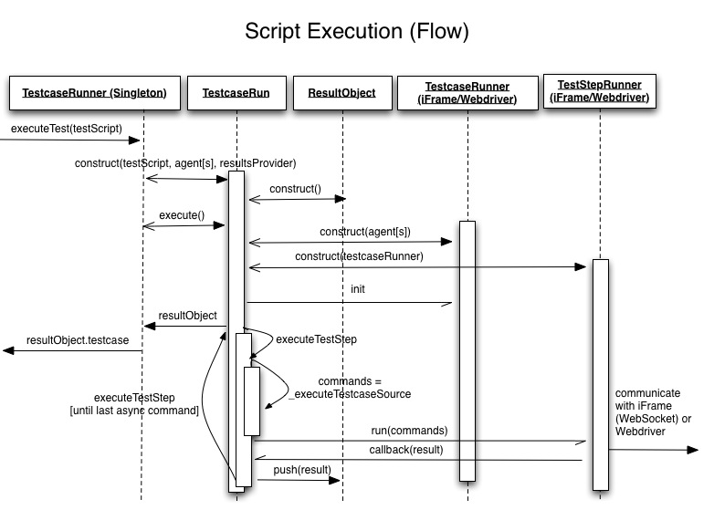

<!-- <copyright>
 This file contains proprietary software owned by Motorola Mobility, Inc. 
 No rights, expressed or implied, whatsoever to this software are provided by Motorola Mobility, Inc. hereunder. 
 (c) Copyright 2011 Motorola Mobility, Inc.  All Rights Reserved.
 </copyright> -->

# Testscript execution

This document describes how we execute inidividual test scripts within Screening and 
it should give an overview of the involved components of our application.

Screening provides a REST-API through which you are able to execute testscripts. This API
is triggered when a Testscript is executed from the Control-Room web application and it also
can be used to execute Testscripts programmatically by an external application.

The following curl-command illustrates how a testscript can be executed through the REST-API.
(assumed that the file `testscriptToExecute.js` is written using the Screening JavaScript API):

    >>> curl -X POST 'http://IP_HOSTNAME:8081/screening/api/v1/agents/AGENT_ID/execute_serialized_code?api_key=5150' -H 'Content-Type: application/json; charset=UTF-8' -H "Origin: http://localhost:8081" -d @testscriptToExecute.js
    {"testId":"XXXXXXX-XXXXXXX-XXXXXXX"}

The Testscript execution is asynchronous and the returned `testId` can be used to get the status of
this particular testrun through the following REST-API call:

    >>> curl http://IP_HOSTNAME:8081/screening/api/v1//test_results/XXXXXXX-XXXXXXX-XXXXXXX

In the following diagram you see the highlevel view of the Testscript execution within Screening. 
It illustrates that a TestScript can either be executed on an iFrame agent, that can be
controlled with JavaScript or on a Webdriver agent, which is providing a REST-API to remote 
control browsers:

The execution of a Testscript is completely handled on the server-side and we just pass the individual
commands, which need to be executed on the client, to the agent. With that method we are able to
execute Testscripts where more than 1 agents are involved and we are able to synchronize that process
on the server-side. Another advantage of this method is, that we are able to allow all the things
that are possible within node.js.

## Detailed description

When a testscript is passed for execution to Screening it'll run through several stages which
will be described in this section.

In Screening we have a Singleton of a `TestcaseRunner` which is responsible for the test execution
and selecting the right agents from the `AgentPool` for a test run. This `TestcaseRunner` receives 
the Testscript and will then instantiate a new `TestcaseRun` instance which itself is then responsible 
for setting up the Testscript execution context and also to run this particular Testscript.

Within a `TestcaseRun` we instantiate the following objects:

* ResultObject (`testcase/result.js`):
  is responsible for collecting all the assert and exception messages which is used to provide
  test result to the user
* ScriptObject (`testcase/script.js`):
  this object is reachable in the test script via the namespace "script." it provides script-wide
  functionality, such as "script.require()" to include other scripts and "script.setOption()" to set
  options for the script execution.
  It also allows to manipulate the behaviour of the test execution, e.g.
  defining various timeouts, how the agent should wait to continue the execution, ...
* Individual TestcaseRunner. Used for communicating with an agent:
  * iFrame-TestcaseRunner (`testcase-runner-iframe.js`):
    is used for communicating with an iFrame-agent, which is doing that through a websocket. This object
    provides the following methods: `init`, `gotoUrl`, `execute` and `close`. Every individual command
    in the Testscript which should be executed on the client-side will use the `execute` method to send
    a JavaScript command. The `iFrame-TestStepRunner` will execute individual agent calls by facilitating
    this object.
  * Webdriver-TestcaseRunner (`testcase-runner-webdriver.js`):
    similar to the `iFrame-TestcaseRunner` but responsible for communicating with a Webdriver server. It
    basically just instantiates a new remote session to a Webdriver by using the Webdriver-client-implementation
    which can be found within `server/lib/webdriver`. The `Webdriver-TestStepRunner` will then use this
    Webdriver session to communicate with it.
* Individual TestStepRunner. This is the component which is sending the individual commands to the agent.
  Within a TestcaseRun we serialize the commands that should be send to the agent and each TestStepRunner
  is interpreting that serialized stream (see details of serializing the steps below):
  * iFrame-TestStepRunner (`teststep-runner-iframe.js`):
    responsbile for sending individual JavaScript commands to the agent through the `iFrame-TestcaseRunner`.
  * Webdriver-TestStepRunner (`teststep-runner-webdriver.js`):
    communicates with a Webdriver session, that is provided by `Webdriver-TestcaseRunner`.

### Make asynchronous agent calls synchronous in a Testscript

The language JavaScript comes with an asynchronous programming model which often is hard to understand
and to write. Within Screening we use JavaScript as the programming language for writing Testscripts
and we want to avoid that a Testscript writer has to deal with the asynchronity that comes with
sending individual commands to a websocket or REST-API. In an asynchronous model you would have to write
the following, if you for example want to go to a URL and then get the title of the current page:

    agent.gotoUrl(function(){
        // finished loading
        agent.getTitle(function(title){
            console.log(title);
        });
    });

As you can see in this example the nesting of the callbacks could get very nasty if you have a bigger
Testscript. Of course we would be able to use a promise or deferred library to let the asynchronous
code look nicer, but that would mean that a Testscript writer would have to learn how he has to code
with these libraries and it also wouldn't help to solve the problem of understanding the asynchronous
programming model. We want that a Testscript author would just have to write the following without
caring about the asynchronous nature of the individual gotoUrl and getTitle call:

    agent.gotoUrl();
    var title = agent.getTitle();
    console.log(title);

This example showcases that we basically want to turn the asynchronous model into a synchronous. To execute 
this script we normally would have to introduce waits internally where the asynchronous calls happen
and this would block the whole execution context of our server. To overcome this problem we do the 
following:

* We use asynchronous calls to the agent internally where they are needed (communicating with websocket,
  REST-API), so they are non-blocking.
* We execute a Testscript as often as there are calls to the agent and fill in a static value at where 
  an asynchronous call happened. The static value will be the return-value that was passed to the callback
  of the asynchronous call. Each execution of the Testscript will throw an exception when the callback
  was received and when it was possible to set the static value so that we can stop executing the current
  step. The final execution of a Testscript will occur when all asynchronous calls got resolved.

### Test script execution under the hood - overview
A little overview on how execution takes place would be like this:
- a test script is executed using the node module vm
- on "hitting" an asynchronous call (a method call that is called on any of the Agent's class method) the testcase-api-wrapper.js
  catches this and creates a command (previously and in some places of the code called "executionStack")
- a command is an object literal that contains a set of instruction(s) that are sent over to the agent
  or is executed on the server side and translated into commands sent to the agent, like gotoUrl() or in all
  cases done in the webdriver execution
  (the set might be just one command, i.e. agent.getTitle() or is might be a set of commands like agent.keyPresses())
  see the test specs in tests/server/agent-api for what a piece of test script is converted into (i.e. agent-spec.js)
- the teststep-runner-iframe.js or teststep-runner-webdriver.js get one command and either
  - send it over to the client/agent (i.e. for iframe's agent.mousedown(), agent.keydown(), agent.setScrollTo(), ...)
  - execute it and create the according command to be sent to the client (i.e. gotoUrl()) or in the webdriver case every command
    (or set of commands) is executed and triggers a call to the webdriver running on the agent
  - some commands like wait() are executed completely on the server, since no agent interaction is required
    (see teststep-runner-iframe.js line 109 or teststep-runner-webdriver.js line 233)
- in the iframe case there is a client side script required that understands the command that was sent, i.e.
  this serialized command: [{command: ['doesElementExist', ["body"]], data: {lineNumber: 1, columnNumber: 13}}]
- if a command had been executed it's result is stored in the resultStack (see testcase-runner.js line 186)
- the test script execution is interrupted and stopped by throwing an error with the message "continue" and caught in the
  TestcaseRun._executeTestcaseSource method, that then knows that the test script has not ended yet
- for the next execution of the test script the last async call is now not being converted into a command anymore and
  sent over but interpreted as a static function call, that returns exectly the result that has been stored
  in the resultStack
- this continues (by calling the inner function "executeTestStep" in testcase-runner.js) until the test script ended
  at this point all the results are stored in the result object

In order to find out if a command needs to be sent to the client/agent or not the testcase-api-wrapper.js checks the
resultStack and finds out if the command had already been executed, if so it triggers to return the right thing, which for
methods that returned a result from the agent such as doesElementExist(), getStyle(), isVisible() etc. is a static value
at this point. There are other functions such as agent.element() that need to return a reference, which is also done in
this file. The testcase-api-wrapper.js is really just a wrapper around the actual testcase-api.js and does only
call the latter one if necessary. (Actually it should have been called testcase-api-decorator.js).

### Test script commands
As touched on in the chapter before, the test script is made up of async calls that don't appear as such in the
test script. In order to allow an efficient synching with the agent the commands are converted into an array that contains
all the information the client needs to know to execute the given command. I.e. the following are converted like so:
    var agent = new Agent();
    agent.gotoUrl('http://google.com')
is converted into
        [[{command: ['gotoUrl',['http://google.com']],
            data: {lineNumber: 1, columnNumber: 13, fileName: TMP_TEST_FILE_NAME}
        }]]
The latter is the command that is passed into the teststep runner and executed accordingly.
The command gotoUrl in this case is one that for an iframe agent triggers the opening of the page and
pointing to this url by calling:
    this.browser.gotoUrl()
where this.browser is the iframe agent. In the webdriver case, this is a little more complex, since we are
opening a popup inside the window, so there is JS wrapped around it which finally is called using this
    self.browser.switchToWindow()
self.browser is the webdriver agent in this case.

Simple calls to agent.element() don't get converted to a command itself, since they are only making sense
when doing something on them. Therefore the following test script code
     new Agent().element('.className').dispatchEvent('abc-unknown-event', {whatever:100});
will be converted to this:
    [[
        {command: ['element', ['.className']]},
        {command: ['element.dispatchEvent', ['abc-unknown-event', {whatever:100}]]}
    ]]
The first command in this structure is the "element" command, which means select this element and the second
is the action executed on it. Even if you chain multiple functions onto the one above each will be generated
as a single command-set as you see above, because methods like dispatchEvent() return the element object again,
to allow chaining.
In order to generate a set of commands that are sent over to the client (in the iframe case) as one piece
and therefore executed faster, and also more convinient to use in the code you need to use, e.g. the following
    new Agent().element('.className').keyPress('a');
where keyPress() is only a wrapper that generates three commands to be sent to the iframe agent, in case of the
webdriver this results in single click, since there are no explicit keydown/press/up commands
    [[
        {command: ['element', ['.className']]},
        {command: ['element.keydown', ['a']]},
        {command: ['element.keypress', ['a']]},
        {command: ['element.keyup', ['a']]}
    ]]
All the command-sets that have an "element" command as first item are handled the same in the iframe agent, they
are serialized and sent over to the agent. In the webdriver case they are handled differently.

### WaitFors
One special case, are the waitFor methods. Those do only use functions that return a value and a recalled
until the timeout exceeds. I.e. waitForElement() does use doesElementExist() calls until the timeout given
is reached or a positive result. This works the same in iframe and webdriver agent. The same applies to
waitForAttributeChange() and waitForAttributeValue(). For waitForAttributeValue() we use getAttributeValue()
and call this multiple times from the server to be run on the agent and compare the returned value, to
our expected value. The function waitForAttributeChange() does first read the current value and compare it
on every request to find out the change. The common functionality for this is abstracted out in to the teststep-runner.js
which is used by the iframe and the webdriver implementation of the teststep runner.
The abstraction of iframe and webdriver runner are unfortunately not yet at a state where the implementation
of a new command needs to happen only in one place. The teststep-runner.js was the first attempt to achieve
this but is not all the way there yet.

### Handling of asserts
The assert handling does all happen server-side, as mentioned before that is essential to be useful with multiple
agents. All asserts are evaluated once, even though the script execution takes place multiple times, in order
to enable asynchronous calls, that assert-decorator.js is the piece of code that takes care of executing the
assert only once and saving it's result. The number of asserts is counted and only every new one is executed and
reported and stored in the result object.
The assert-decorator.js actually provides a decorator to all assert functions and decides on it's own
when to call the underlying assert function from the assert.js. Therefore only the assert-decorator.js is imported
in the actual test script (see testcase-runner.js) in the method "TestcaseRun._executeTestcaseSource"
an agent class is passed into the test script's scope.
All assert functions themselves are very simple functions, that only report tru or false. Even the messages
that can be passed into the are not handled in the assert functions itself, they are "captured" in the decorator
and passed on to the result object.
